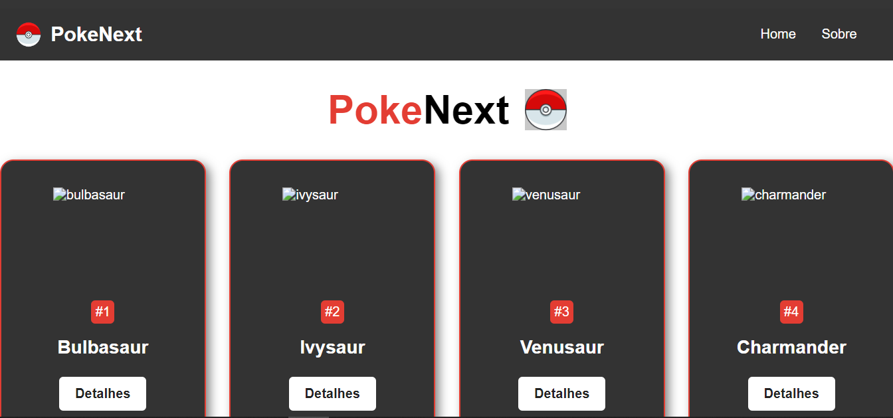
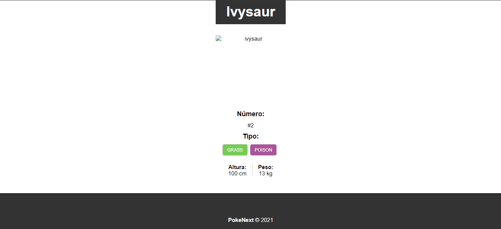
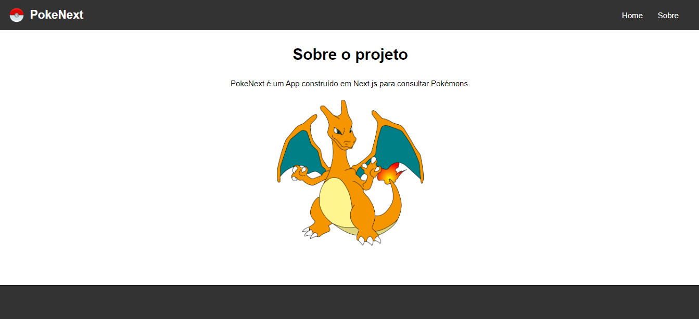

# PROJETO POKENEXT
👨‍🏫PROJETO CRIADO PARA O CURSO DE NEXTJS.

 <br> 
 <br> 
 <br> 

## DESCRIÇÃO:
Este é um projeto de exemplo criado com Next.js, que é um framework React para desenvolvimento de aplicações web. O objetivo deste projeto é criar uma aplicação de Pokédex, onde os usuários podem visualizar informações detalhadas sobre diferentes Pokémon, utilizando dados da PokeAPI. A aplicação demonstra o uso de rotas dinâmicas, requisições a APIs, carregamento de dados estáticos, e a criação de componentes estilizados.

## FUNCIONALIDADES:
1. **Listagem de Pokémon:** Exibe uma lista de Pokémon utilizando dados obtidos da PokeAPI.
2. **Detalhes do Pokémon:** Permite aos usuários clicarem em um Pokémon para ver detalhes como nome, imagem, número, tipos, altura e peso.
3. **Rotas Dinâmicas:** Utiliza rotas dinâmicas para gerar páginas individuais para cada Pokémon.
4. **Estilização com CSS Modules:** Estiliza a aplicação utilizando CSS Modules para componentes encapsulados e com escopo local.
5. **Imagens Otimizadas:** Utiliza o componente `Image` do Next.js para carregamento otimizado de imagens.

## EXECUTANDO O PROJETO:
1. **Instalar as dependências do projeto**:
   - Execute o comando no diretório `CODIGO/`:
     ```cmd
     npm install
     ```
   Este comando instala todas as dependências listadas no arquivo `package.json` do seu projeto. Certifique-se de estar no diretório do seu projeto ao executar este comando.

2. **Executando o Aplicativo:**
   - Para subir o servidor abra Terminal/CMD e digite o seguinte comando:
   ```bash
   npm run dev
   ```
   - Acesse o APP no navegador visitando [`http://localhost:3000/`](http://localhost:3000/).

## NÃO SABE?
- Entendemos que para manipular arquivos em `HTML`, `CSS` e outras linguagens relacionadas, é necessário possuir conhecimento nessas áreas. Para auxiliar nesse aprendizado, oferecemos cursos gratuitos disponíveis:
* [CURSO DE HTML E CSS](https://github.com/VILHALVA/CURSO-DE-HTML-E-CSS)
* [CURSO DE JAVASCRIPT](https://github.com/VILHALVA/CURSO-DE-JAVASCRIPT)
* [CURSO DE NODEJS](https://github.com/VILHALVA/CURSO-DE-NODEJS)
* [CONFIRA MAIS CURSOS](https://github.com/VILHALVA?tab=repositories&q=+topic:CURSO)

## CREDITOS:
- [PROJETO FEITO PELO VILHALVA](https://github.com/VILHALVA)
- [PROJETO CRIADO PARA O CURSO DE NEXTJS](https://github.com/VILHALVA/CURSO-DE-NEXTJS)


